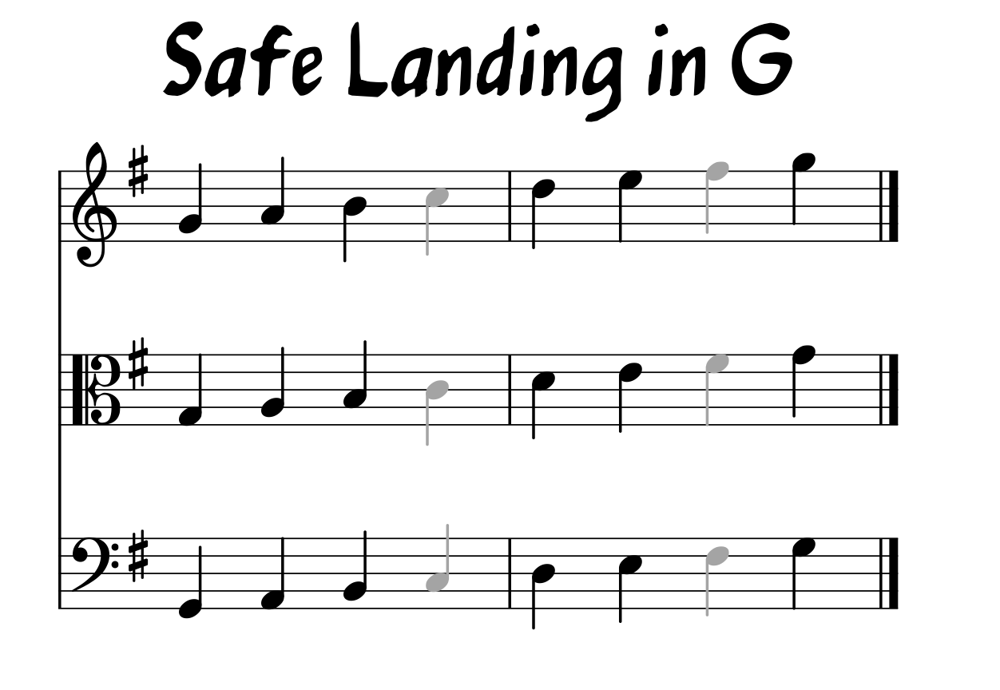

```{r setup, include=FALSE}
knitr::opts_chunk$set(echo = TRUE)

library(ggplot2)
library(dplyr)
library(devtools)
library(knitr)
library(kableExtra)


```

## Intro

**Musical improvisation and composition** can seem like a mysterious thing -- and quite a leap from simply playing pre-scripted notes on a page of written music.

And, yet, most of us do it pretty un-self-consciously all the time as we hum, whistle, or la-de-da sing to ourselves -- or, in my case, to my dog and cat when I'm feeding them in the morning -- and we're never at a loss for what note to play next. 

How is that we seem know without thinking about it much what things are going to sound right as we spontaneously compose like this? Where does "inspirado" come from? And how far is the crossing from just being able to whistle, hum, or sing to being able to translate that act of *improvisatory composition* to an instrument?

This project tries to take one small step for a Viper -- but one giant leap for Viper-kind -- toward demystifying the process of **how to make stuff up**. I hope to show you that, at some really basic level, you're not actually working without a net out there on the highwire once you step off the platform of written notes. In fact, if you know even a little bit about the `key`, the `chords`, and the `style` of the music you're playing, you'll find a number of more-or-less slip-proof platforms to serve you as landings all along the rope.

How about we take that first doozy of a step!

## The Keys to the Kingdom

So here's the first couple of lines of the melody of **"Another Day,"** a new song that the Viper will premiere with the **Chamber Orchestra** of the **Lake Zurich Middle School North** orchestra program led by **Mr. Riley Broach**. (This is part of the program's annual Spring Concert happening on Thursday, May 17 at 7:00 p.m. -- the Viper will be doing a piece with **Intermezzo Orchestra** as well.) Looking at it (in treble, alto, and bass clef), it goes like this:


What can we learn from this snippet? First of all, we can learn that the Viper wrote this in the `key` of G Major (or, possibly, E Minor). 

How do we know that? Well, the key signature tells us -- one sharp means that the "legal" notes in this key are the essentially the white keys of the piano (with one exception): `G`, `A`, `B`, `C`, `D`, `E`, and `F-sharp`.


None of these notes will sound *bad* in this song, though some will work better as *passing* (tightrope) tones than as *landing* (platform) tones. Which ones? We'll look at that question next.

## You're an Extraordinary Machine

Science tells us that even without seeing the key signature, your ear and your brain would figure out the key for you, just from hearing the collection of notes, where they land relative to the measures and the phrasing, and how often they occur. (I know "science tells us" sounds weaselly, but see Daniel J. Levitin's book from a few years ago, *This Is Your Brain On Music*, to see that I am actually getting this from somewhere!)

In other words, if I sang this song to you -- even without playing the chords -- and then asked you to hum the "home" note, most of you would get it right and hum a `G`.

And, in some way, you're just trying to reverse this process when you improvise or re-compose this song. You're providing a collection of notes, at the right times, and at the right places, that would let your listeners and *their brains* understand the underlying harmony of the song.

So to see what material your brain is working with, let's just look at one of these issues: the question of note frequency -- or, rather, let's let a processing machine look at it the way your brain or your listener's brain might. 

I wrote a little counting script in a programming a language called Python and fed it the notes from the [lead sheet](https://github.com/ryanjerving/note-frequencies/blob/master/docs/Another_Day_Violin.pdf) version of the melody that I'd provided earlier to the LZOrk Chamber Orchestra musicians, and then transcribed the results to a [csv spreadsheet](https://github.com/ryanjerving/note-frequencies/blob/master/datasets/another-day-frequency.csv) that I could feed into a data science environment called R and spit it out as a chart. Soulful, huh? (Raw results at the bottom of this page).

```{r another-day-note-frequency-plot, echo = FALSE}

# Use R to read in "Another Day" note count data from csv stored in in GitHub documents for project.
# We'll call this new data object "ad" (for "Another Day")

ad <- read.csv("https://raw.githubusercontent.com/ryanjerving/note-frequencies/master/datasets/another-day-frequency.csv")

# Plot bar chart of "ad" showing each scale note by its frequency appearing, with fill color reflecting this as well.

ggplot(ad, aes(x = Note, y = Frequency, fill = Frequency)) + 
  geom_col() + 
  labs(title = "Frequency of Notes in 'Another Day'")


```

## Analysis and Recommendations

There *are* some surprises here. 

### Let It B

First, notice that even though we're in the `key` of G, `G` is not the most common note in "Another Day."" It's up there, for sure. 

But it's bested, slightly, by humble ol' `B`. This is surprising because, while B *is* a note in a basic **G Major** triad chord (which has `G`, `B`, and `D` as its notes), it's not in any of the other three main chords of the song: **A Minor** (`A`, `C`, `E`), **C Major** (`C`, `E`, `G`), or **D Major** (`D`, `F#`, `A`). 

This suggests that, for this particular song, the melody relies for its "flavor" on a note you might not otherwise expect to be so prominent -- so `B` is probably an especially good note for you use when you're making stuff up.

### I'll (Not) Be C'ing You in All the Old Familiar Places

Also surprising, the second-least-used note is `C` even though you'll see in the list right above this that `C` shows up in 2 (and sometimes 3) of the four main chords. (I say "sometimes 3" because `C` is also part of a D chord when it's used as a *dominant 7th* or "turnaround" chord to get back to G Major). 

So go ahead and use `C` when you're out on the tightrope, especially over an A Minor, C Major, or D Major. But you're probably going to use it as a passing tone rather than a landing one.

### A Minor Upset

`A` and `E` also are more common than you might expect, probably because they are both in an A Minor chord, which plays a pretty important role in this song (it's a major key song that, in the verses, pretends to be minor).

### Get Pentatonic

But overall, your top five **landing notes** in "Another Day" are `B`, `G`, `A`, `E`, and `D`: maybe not surprisingly, these also happen to be the five notes that make up what we call the G Major **pentatonic** (or "five-tone") scale that's very common in rock, country, and folk styles: `G`, `A`, `B`, `D`, and `E`. (The **riff** the orchstra plays in parts of the song is made up of three of these notes: `G`, `A`, and `E`: you can do a lot with just those three!)

Good luck, and safe landing!



## Raw Numbers

```{r another-day-note-frequency-table, echo = FALSE}

knitr::kable(ad, format = "html", caption = "Note Frequencies in 'Another Day'") %>%
  kableExtra::kable_styling(bootstrap_options = "striped",
                            full_width = FALSE)

```


